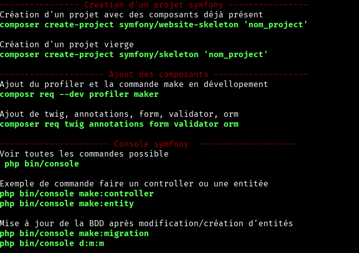

# Commande utiles Symfony

Petit dépôt qui récapitule toutes les notes vues en cours.

```
git clone https://github.com/Kagarie/Note_Symfony.git
```

Installation

```BASH
cd Note_symfony
./installFac.sh
```
Plus qu'a reboot votre Terminal pour l'utiliser.

Utilisation 
```BASH
note
```

Aperçu


